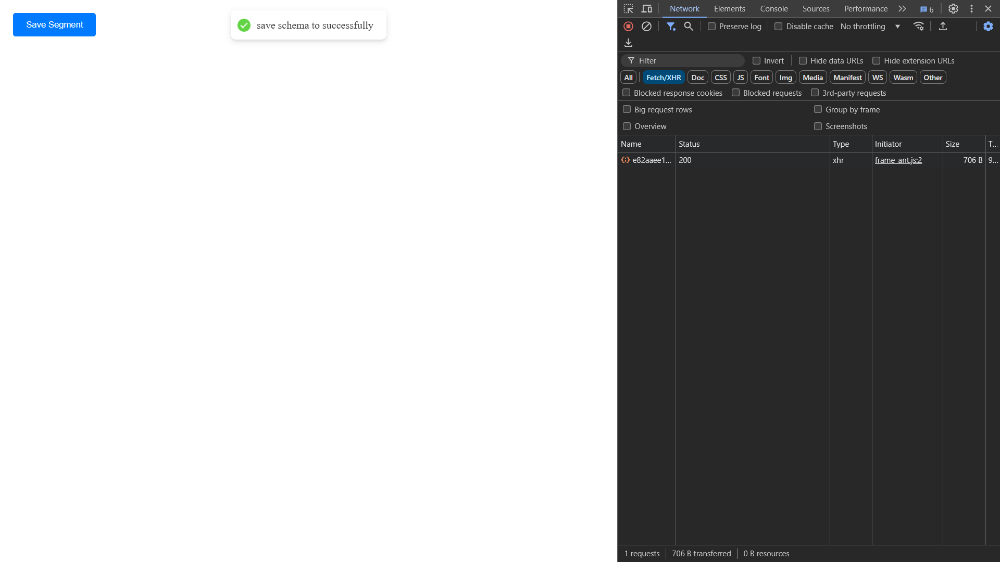

## webhook information

- **Webhook Testing URL:** `[Testing URL](https://webhook-test.com/e82aaee1a37770dfe3a17fcd840a5b77)`
- **website:** `[website](https://webhook-test.com)`

## success Operation

